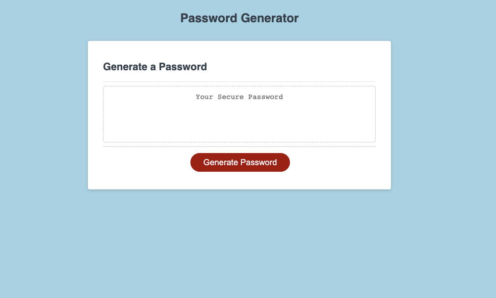
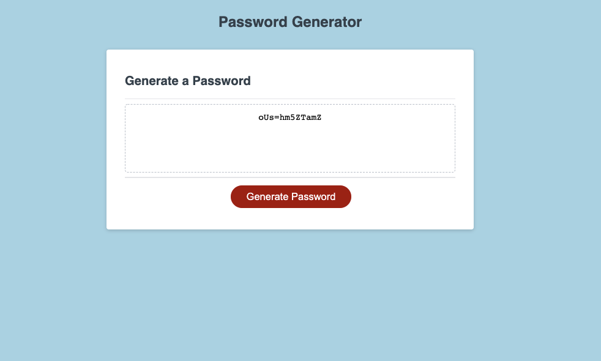

# Password-Generator
## Table of Content
[Description](#Description)
[Screenschots](#Screenshots)
[Links](#Links)
[Contact](#Contact Me)

## Description

The app will produce a randomized password for security purposes. 
The app utilizes a function to generate the password by prompting the user for input.
After the user input the app, executes if loops to concat the variable into the password if the user elects to include the variable.

## Screenshots

## Links

Deployed App:[https://sytrejo.github.io/Password-Generator/](https://sytrejo.github.io/Password-Generator/)

Github Repo:[https://github.com/sytrejo/Password-Generator](https://github.com/sytrejo/Password-Generator)

## Contact Me

github: sytrejo

